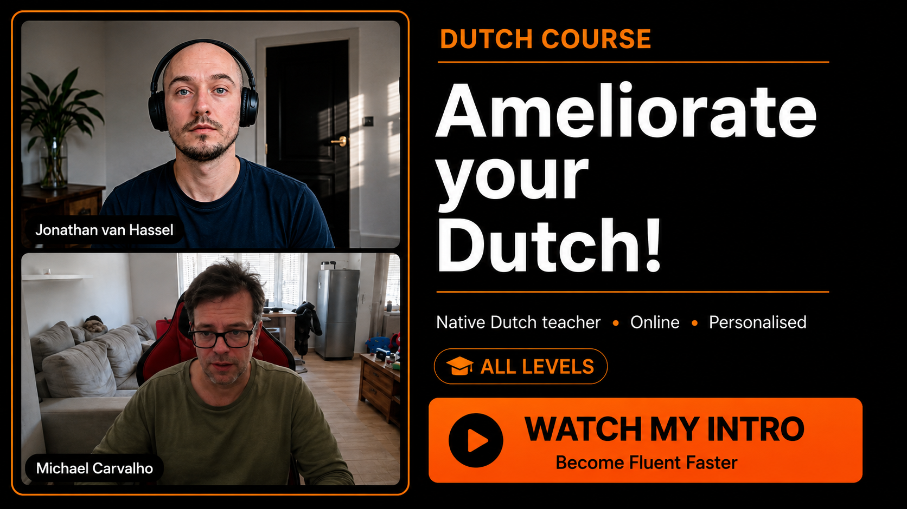

# TalkingDutch.com



Official website for **Talking Dutch Online** — an online Dutch learning platform created by Jonathan van Hassel.

The website promotes Dutch language lessons for beginners to advanced learners and focuses on practical speaking skills, pronunciation, grammar, and real-life communication.

---

## Features

* Modern responsive landing page
* Dutch course promotion and lesson overview
* Teacher introduction section
* Video / thumbnail integration
* Contact and booking sections
* Optimized for online language tutoring
* Clean black/orange visual branding

---

## About the Teacher

**Jonathan van Hassel** is a native Dutch teacher with:

* Master of Arts degree
* BKO teaching qualification
* TEFL certificate
* Experience teaching English in China (2016–2021)
* Experience teaching Dutch online internationally

The lessons focus on:

* Speaking confidence
* Pronunciation
* Vocabulary building
* Sentence structure
* Role-plays and conversation practice
* Practical everyday Dutch

---

## Website Goal

TalkingDutch.com is designed to help learners:

* Improve conversational Dutch
* Build confidence speaking with native speakers
* Prepare for work or life in the Netherlands or Belgium
* Learn Dutch naturally through structured lessons

---

## Branding

Primary design elements:

* Black background
* Orange accent color
* Minimal modern UI
* YouTube-style promotional thumbnails
* High-contrast typography

---

## Tech Stack

* HTML5
* CSS3
* JavaScript
* GitHub
* Netlify

---

## Project Structure

```bash id="6dks0x"
/assets        # Images, thumbnails, graphics
/css           # Stylesheets
/js            # JavaScript files
/videos        # Intro and promotional videos
index.html     # Main landing page
```

---

## Deployment

The project can be deployed using:

* Netlify
* GitHub Pages
* Cloudflare Pages
* Traditional web hosting

### Example Netlify Deployment

1. Push the project to GitHub
2. Connect repository to Netlify
3. Set custom domain:

```bash id="cv91zl"
talkingdutch.com
```

4. Deploy

---

## SEO Keywords

* Learn Dutch online
* Native Dutch teacher
* Dutch lessons online
* Dutch pronunciation
* Dutch conversation practice
* Dutch tutor
* Speaking Dutch confidently

---

## Future Improvements

* Student dashboard
* Booking integration
* Payment system
* Blog articles
* Interactive exercises
* Mobile app support

---

## Contact

Website: https://talkingdutch.com

---

## License

This project and its content are proprietary and intended for the Talking Dutch Online platform.
